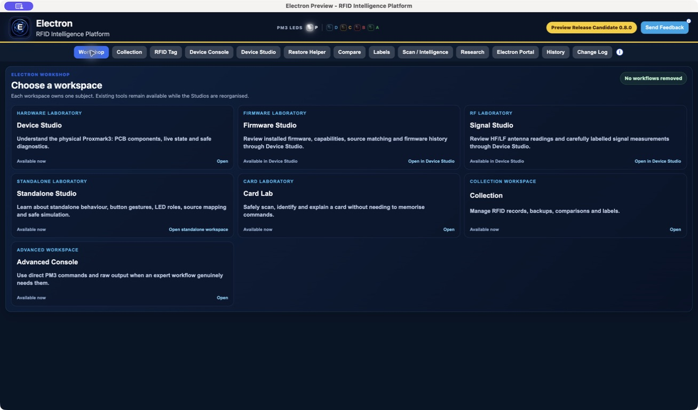
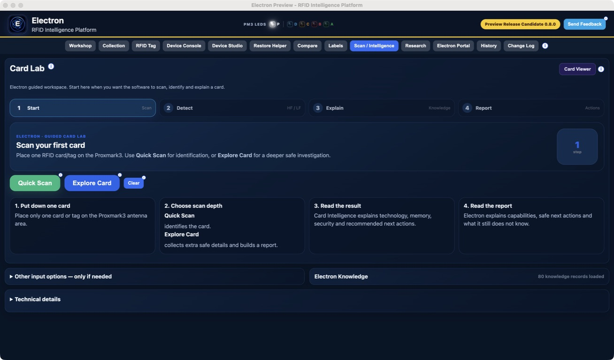

# Electron RFID Intelligence Platform

Electron is a local-first workspace for understanding Proxmark3 scans,
organising RFID Tag records and reviewing hardware evidence.

It is designed for new Proxmark3 owners, returning users, RFID learners,
researchers and experienced users who want guided workflows without losing
access to technical evidence.

## Public Preview 1

Electron Early Public Preview 1 is publicly available for MacOs on Apple
Silicon. The application version is `0.8.0`.

Download only through the official website or its linked GitHub release, and
verify the published SHA-256 before opening the installer.

The standard Preview provides 30 days of full access from first launch. Saved
Collection data is not deleted when the Preview expires. Additional approved
testing time uses a signed Preview Extension Key tied to the local Installation ID.

## What Electron can do

- Connect to a compatible Proxmark3 over USB.
- Run guided HF and LF identification scans.
- Review scan evidence in Card Lab and Card Viewer.
- Store and organise RFID Tag records in Collection.
- Compare records, prepare labels and review history.
- Use Device Studio for safe, read-only hardware diagnostics.
- Use Device Console when an expert workflow needs direct PM3 commands.
- Create local reports and a feedback package you can inspect before sharing.

Available information depends on the connected hardware, PM3 client, firmware
and RFID technology.

## Evidence Before Inference

Electron distinguishes what the device reported from what Electron observed,
calculated or inferred. If a conclusion is not supported by available
evidence, Electron should show it as **Unknown** instead of guessing.

## Start here

1. Read the [Public Preview Notice](PUBLIC_PREVIEW_NOTICE.md).
2. Follow the [Installation Guide](INSTALLATION_GUIDE.md).
3. Use the [Quick Start](QUICK_START.md) for the first safe scan.
4. Continue with the [User Guide](USER_GUIDE.md).
5. Check [Known Limitations and Issues](KNOWN_LIMITATIONS.md).

## Documentation

- [Installation Guide](INSTALLATION_GUIDE.md)
- [Quick Start](QUICK_START.md)
- [User Guide](USER_GUIDE.md)
- [Public Preview Notice](PUBLIC_PREVIEW_NOTICE.md)
- [Known Limitations and Issues](KNOWN_LIMITATIONS.md)
- [Frequently Asked Questions](FAQ.md)
- [Support Guide](SUPPORT.md)
- [Public Preview 1 Release Notes](RELEASE_NOTES_PUBLIC_PREVIEW_1.md)
- [Changelog](CHANGELOG.md)
- [Licences and Third-Party Notices](THIRD_PARTY_NOTICES.md)

The official website provides product information, screenshots, documentation,
download status and support:

<https://electronplatform.github.io>

GitHub is used for source code, releases, issues and development information
as those resources are made public:

<https://github.com/ElectronPlatform/electron-rfid-intelligence-platform>

## Responsible use

Only scan, test, restore, write or copy RFID items that you own or are
authorised to work with. Review commands and backups before any action that
could change a card, tag or device.

Electron is Preview software. Keep independent backups and verify important
results.

Created by Ronald Peters.
Developed with the assistance of OpenAI's ChatGPT and OpenAI Codex.
