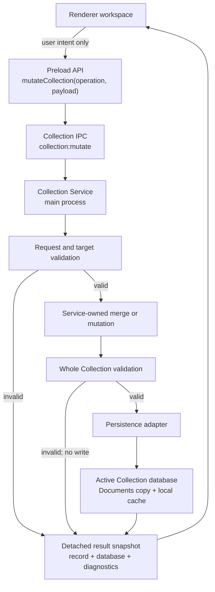
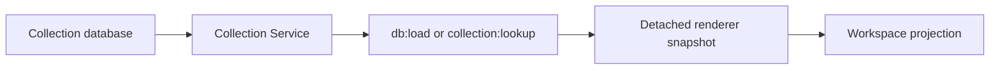

# Electron Collection Service Boundary

**Status:** Phase 2.2 implemented boundary

**Purpose:** Make the main process the single authority for durable Collection
mutations without assigning `recordId` values or migrating the database.

**Follow-on status:** Phase 2.3 has since added explicit migration methods and
v6 create/duplicate ID assignment behind this same service boundary. The
historical Phase 2.2 statements below remain the boundary at that phase; see
[COLLECTION_MIGRATION_PHASE_2_3.md](COLLECTION_MIGRATION_PHASE_2_3.md).

## 1. Ownership

The Collection Service is the authoritative owner of:

- create;
- edit;
- rename;
- duplicate;
- archive;
- restore;
- delete;
- lookup;
- user-visible asset number reservation;
- Collection settings updates;
- existing import application;
- complete database replacement and clear operations.

The renderer owns only:

- temporary form values;
- UI-level validation;
- the currently selected record reference;
- read snapshots used for display, comparison and export preparation;
- mutation intent.

A renderer snapshot is not authoritative. Changing it cannot persist anything.

## 2. Mutation flow



Rendering has no edge to persistence.

## 3. Read flow



`db:load` remains as a compatibility read name, but the data is obtained
through `CollectionService.snapshot()`.

Record lookup is available through `collection:lookup`. Returned records are
detached copies.

## 4. IPC contract

### Mutation

Renderer/preload call:

```text
mutateCollection(operation, payload)
```

Preload invokes:

```text
collection:mutate
```

Request:

```json
{
  "operation": "edit",
  "payload": {
    "targetAssetId": "#12",
    "changes": {
      "alias": "Workshop card"
    }
  }
}
```

Success:

```json
{
  "ok": true,
  "operation": "edit",
  "record": {},
  "database": {},
  "diagnostics": [],
  "summary": {
    "updated": true
  }
}
```

Expected validation failure:

```json
{
  "ok": false,
  "operation": "edit",
  "record": null,
  "database": {},
  "diagnostics": [
    {
      "code": "collection-record-not-found",
      "severity": "error",
      "path": "$.payload.targetAssetId",
      "message": "The Collection Record to edit does not exist.",
      "details": {}
    }
  ]
}
```

Expected validation failures do not need to become renderer exceptions and do
not persist a partial mutation.

### Lookup

Renderer/preload call:

```text
lookupCollectionRecord({ assetId })
```

or:

```text
lookupCollectionRecord({ recordId })
```

The returned record is a detached read copy.

## 5. Internal-field preservation

Renderer record forms send only editable field values. The service merges
those values into the authoritative record.

These known identity fields are service-owned:

- `recordId`;
- `identitySchemaVersion`;
- `previousAssetIds`.

They are ignored if supplied in renderer edit/create payloads.

Unknown existing properties are also preserved because edits merge approved
changes into the current authoritative object rather than reconstructing the
object from form fields.

The service validates `recordId` immutability after every applicable mutation.

At the Phase 2.2 snapshot, Version 6 create and duplicate returned
`record-id-assignment-out-of-scope`. Phase 2.3 now gives the Collection
Service narrow authority to generate a fresh recordId for v6 create and
duplicate. Renderer-supplied identity remains ignored.

## 6. Existing workflow compatibility

| Existing workflow | Phase 2.2 adapter |
| --- | --- |
| New RFID Tag | service `reserveAssetId`, then `create` |
| Save RFID Tag | service `edit`, or `create` for an unsaved form |
| Edit visible RFID Tag ID | service-owned rename during `edit` |
| Duplicate RFID Tag | service `duplicate` |
| Mark Unusable | service `edit` |
| Delete RFID Tag | service `delete` |
| Store/remove photo | service `edit` with photo intent |
| Save backup references | service `edit` |
| Store managed dump | service `edit` |
| Import selected records | service `legacyImport` compatibility operation |
| Photo storage settings | service `updateSettings` |
| Restore complete database | service `replaceDatabase` |
| Clear database | main-process backup, then service `clear` |

The existing import review UI remains unchanged. The compatibility operation
accepts the same selected v5 records while preventing renderer-supplied identity
fields from entering the active database. Identity-aware import remains Phase
2.4 work.

## 7. Persistence boundary

The low-level `loadDatabase()` and `saveDatabase()` functions remain
main-process storage adapters.

- `saveDatabase()` is passed only to the Collection Service as its persistence
  callback.
- no `db:save` IPC handler exists;
- preload exposes no `saveDb`;
- renderer `render()` never saves;
- renderer helper modules no longer modify Collection records before writing.

The load adapter may reconcile same-version Documents and local-cache copies.
That is storage-copy maintenance initiated by the Collection Service read path,
not a renderer-owned domain mutation.

When one valid copy is v5 and the other is v6, normal load selects v6 but does
not reconcile either file. Only the explicit Phase 2.3 transaction may finish
that partial roll-forward.

Export writes remain separate because they write user-selected export files,
not the active Collection database.

## 8. Validation boundary

Before persistence the service:

1. validates the operation;
2. validates the current Collection;
3. validates target existence where applicable;
4. validates active `assetId` uniqueness;
5. protects internal fields;
6. validates identity immutability;
7. validates the complete result with the Phase 2.1 Collection validator;
8. persists only a valid result.

The `clear` and `replaceDatabase` administrative operations can recover from an
invalid current database, but their replacement result is validated before it
becomes active.

## 9. Explicit non-capabilities

The Phase 2.2 boundary itself did not:

- generate or assign `recordId`;
- migrate v5 to v6;
- create Relationships;
- resolve identity;
- link Observations;
- redesign History;
- redesign import or export;
- change Card Viewer, Scan or workspace structure.

Phase 2.3 adds only controlled identity migration and v6 create/duplicate ID
authority. It still does not add Relationships, identity resolution,
Observation linking or identity-aware import/export.

## 10. Remaining legacy/read paths

The following are intentionally retained:

- renderer read snapshots for current workspace projections;
- `assetId` as the current renderer selection and compatibility lookup key;
- legacy Collection log rows;
- existing import review and export preparation in the renderer;
- existing JSON/CSV export formats;
- existing Intelligence/localStorage stores;
- low-level main-process database-copy adapters.

None of these retained paths can write the active Collection database outside
the Collection Service.
